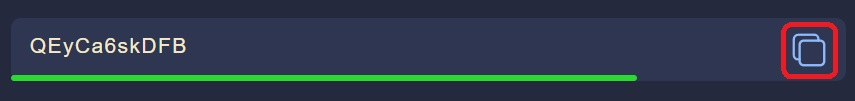
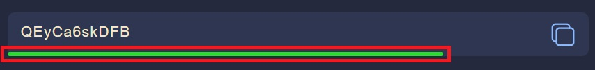
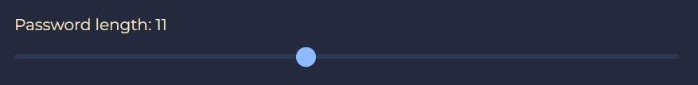
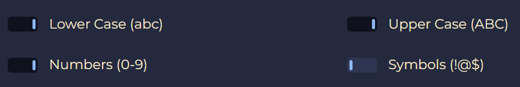

# Random Password Generator

This password generator is designed to create complex passwords consisting of random numbers, symbols, and letters.

[Create password](https://denysbohdanenko.github.io/password-generator/)

## Copy button

A copy button is located next to the generated password for easy copying to the clipboard.

## Password strength indicator

The password strength indicator provides visual feedback on the strength of the generated password.

The colors represent:

Red: Weak password  
Yellow: Moderate password  
Green: Strong password  
Blue: Very strong password

## Adjustable length

Below the output window, there is a slider for selecting the password length.

## Filters

Additionally, there are four filters in the form of checkboxes, allowing you to select the content of the password:

- numbers
- symbols
- uppercase
- lowercase

## Usage

1. Adjust the password length using the slider.
2. Select the desired password content using the checkboxes.
3. Click the "Generate" button to generate a new password.
4. Click the copy button next to the generated password to copy it to the clipboard.
